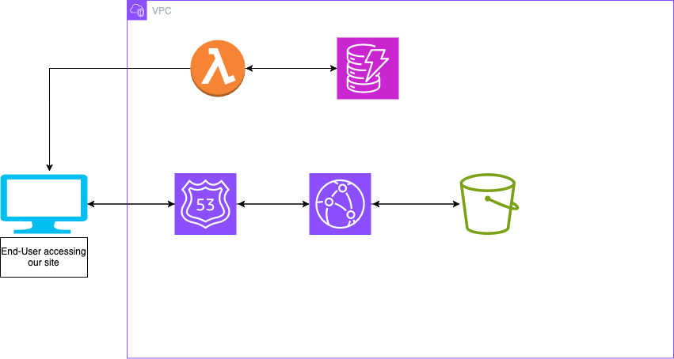

# S3-Cloud-Resume

This repo contains the code and configurations files to deploy a S3 bucket to host my static site as part of the cloud resume challange: https://cloudresumechallenge.dev/docs/the-challenge/aws/

# Resources used

This is being managed and deployed using IaC by leveraging Terraform to write out the inrastructure and using a mixture of the following AWS resources:
<ul>
  <li>AWS S3 - bucket to host my static HTML and JS files</li>
  <li>Lambda - A serverless application that writes to DynamoDB to store total amount of views the site has</li>
  <li>DynamoDB - NoSQL database to hold my total amount of view counts</li>
  <li>Route 53 - Hosts the domain for static site </li>
  <li>CloudFront - CDN solution to optimize caching of static site for better site performance and security</li>
</ul>

# Infrastructure example and diagram

